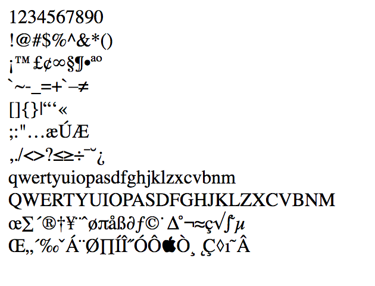

# escape-html

- [github: node-escape-html.lib](https://github.com/f0c1s/node-escape-html.lib)
- [npm: @f0c1s/escape-html](https://www.npmjs.com/package/@f0c1s/escape-html)

## Installation

```bash
npm i @f0c1s/escape-html
```

## Usage

```javascript
var { escape } = require('@f0c1s/escape-html');

var data = [
'1234567890',
'!@#$%^&*()',
'¡™£¢∞§¶•ªº',
'`~-_=+`–≠',
'[]\{}|“‘«',
';:"…æÚÆ',
',./<>?≤≥÷¯˘¿',
'qwertyuiopasdfghjklzxcvbnm',
'QWERTYUIOPASDFGHJKLZXCVBNM',
'œ∑´®†¥¨ˆøπåß∂ƒ©˙∆˚¬≈ç√∫˜µ',
'Œ„´‰ˇÁ¨Ø∏ÍνÓÔÒ¸˛Ç◊ı˜Â'
];

data.forEach(d => console.log(escape(d)));

// output
[
    '1234567890',
    '&#x21;&#x40;&#x23;&#x24;&#x25;&#x5e;&amp;&#x2a;&#x28;&#x29;',
    '&#xa1;&#8482;&#xa3;&#xa2;&#8734;&#xa7;&#xb6;&#8226;&#xaa;&#xba;',
    '&#x60;&#x7e;-_&#x3d;&#x2b;&#x60;&#8211;&#8800;',
    '&#x5b;&#x5d;&#x7b;&#x7d;&#x7c;&#8220;&#8216;&#xab;',
    '&#x3b;:&quot;&#8230;&#xe6;&#xda;&#xc6;',
    ',.&#x2f;&lt;&gt;&#x3f;&#8804;&#8805;&#xf7;&#xaf;&#728;&#xbf;',
    'qwertyuiopasdfghjklzxcvbnm',
    'QWERTYUIOPASDFGHJKLZXCVBNM',
    '&#339;&#8721;&#xb4;&reg;&#8224;&#xa5;&#xa8;&#710;&#xf8;&#960;&#xe5;&#xdf;&#8706;&#402;&copy;&#729;&#8710;&#730;&#xac;&#8776;&#xe7;&#8730;&#8747;&#732;&#xb5;',
    '&#338;&#8222;&#xb4;&#8240;&#711;&#xc1;&#xa8;&#xd8;&#8719;&#xcd;&#xce;&#733;&#xd3;&#xd4;&#63743;&#xd2;&#xb8;&#731;&#xc7;&#9674;&#305;&#732;&#xc2;'
]
    
```

Also,go to browser and document.write these strings check out following image. 



## LICENSE

MIT
